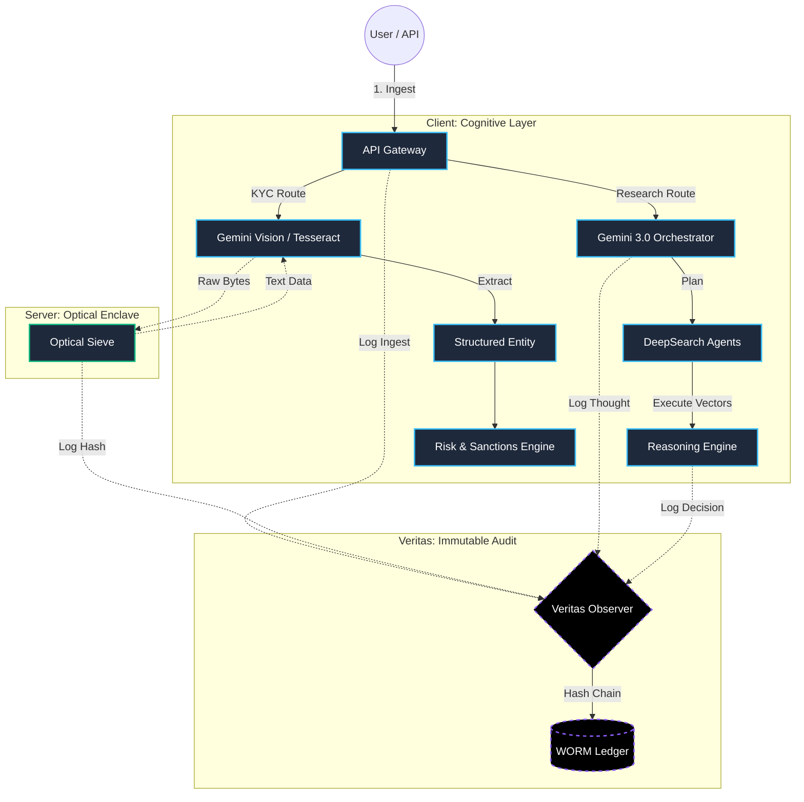

# FoundLab Suite: Auditable Trust Infrastructure (ATI)

<div align="center">

  

  <br />

  [](https://opensource.org/licenses/MIT)
  
  
  
  

  <h3>Operational Alpha ($\Sigma\alpha$) • Compliance-as-Infrastructure • Privacy by Design</h3>

</div>

## ⚡ The Strategic Convergence

FoundLab Suite represents the architectural unification of three distinct technological paradigms into a single **Auditable Trust Infrastructure (ATI)**. It is not just a tool; it is a sovereign decision engine.

### 1. The Cognitive Engine: Google Gemini 3.0 🧠
At the helm of orchestration lies **Gemini 3.0 Pro**. Far beyond simple text generation, FoundLab utilizes Gemini's **Thinking Mode** and **Agentic Capabilities** to:
*   **Orchestrate Investigations:** Deconstruct complex regulatory queries (SOX, FATF, LGPD) into execution vectors using "Chain-of-Thought" reasoning.
*   **Forensic Reasoning:** Apply deep logic to detect "Innovation Theater" and structural risks in KYC documents, going beyond surface-level data.
*   **DeepSearch Agent:** A sovereign researcher that navigates the web, sanitizes inputs, and synthesizes decision-ready intelligence in real-time.

### 2. The Optical Sovereign: Palantir-Grade Tesseract 👁️
Data ingress is secured by the **Optical Sieve**, a hardened implementation of the Tesseract engine engineered on **Palantir Foundry** principles.
*   **Zero-Persistence OCR:** Documents are processed in volatile memory enclaves. No raw data touches the disk, ensuring absolute data sovereignty.
*   **Deterministic Extraction:** High-fidelity conversion of unstructured pixels into structured, machine-readable JSON.
*   **Industrial-Grade Computer Vision:** Built to withstand the noise of real-world documents while maintaining audit-ready precision.

### 3. The Trust Protocol: FoundLab Veritas 🛡️
The binding layer that transforms ephemeral AI operations into permanent legal evidence.
*   **Black-Chain Ledger:** Every AI decision, Optical extraction, and User action is hashed, timestamped, and cryptographically chained.
*   **Compliance-as-Code:** Regulatory rules are baked into the infrastructure, not checked after the fact.

## 🧩 Sovereign Domain Architecture

The suite is divided into two sovereign domains:

### 1. Client: The Intelligent Interface (`/client`)
Built with **React, Vite, and TypeScript**, integrated with **Google Gemini 3.0**.
*   **DeepSearch Agent:** Autonomous research agent capable of executing multi-step investigations ("VC Killshot", "Compliance Audit").
*   **KYC Workflow:** Real-time document parsing, liveness detection, and risk scoring.
*   **Registry Search:** Direct integration with public and private data sources.
*   **Cognitive Orchestrator:** Breaks down complex queries into executable vectors using Gemini Pro.

### 2. Server: The Trust Engine (`/server`)
Built with **Python**, focusing on cryptographic integrity and heavy processing.
*   **Optical Sieve (Palantir Tesseract Engine):** A hardened, privacy-first implementation of Tesseract OCR designed for "Zero-Persistence" environments. It creates a sovereign optical layer that processes documents without retaining raw data, ensuring compliance with strict data governance protocols.
*   **Veritas Observer:** The core auditing protocol that hashes and chains every action into an immutable ledger (Black-Chain).
*   **Umbrella KMS:** Key management and encryption standards.

## � End-to-End Workflow



## �🚀 Getting Started

### Prerequisites
*   Node.js v18+
*   Python 3.9+
*   Google Gemini API Key

### Installation

1. **Clone the repository**
   ```bash
   git clone https://github.com/your-org/foundlab-suite.git
   cd foundlab-suite
   ```

2. **Setup Server (Trust Engine)**
   *Required for Veritas Auditing & Umbrella Encryption.*
   ```bash
   cd server
   python -m venv venv
   # Windows: .\venv\Scripts\activate
   # Linux/Mac: source venv/bin/activate
   pip install -r requirements.txt
   python main.py
   ```
   *Server runs at `http://localhost:8000`*

3. **Setup Client (Cognitive Interface)**
   ```bash
   cd ../client
   npm install
   
   # Setup Environment
   cp .env.example .env
   # Edit .env and add your VITE_GEMINI_API_KEY
   
   npm run dev
   ```
   *Client runs at `http://localhost:3000`*

## 📋 Latest Updates (Current Version)

*   **Standalone Mode:** Client fully functional with local orchestration, decoupled from backend for rapid deployment.
*   **Global Live Search:** Real-time registry verification using Gemini Grounding (Google Search) for entities not in local databases.
*   **DeepSearch Reports:** Generation of professional PDF intelligence reports with sourced citations and trust scores.
*   **Enhanced KYC:** Specific prompts for International Transactions, OFAC/FATF alignment, and Shell Company detection.
*   **UI/UX Polish:** Document Preview Modal, Improved File Management, and Custom Branding Integration.
*   **Fast Deploy:** Dockerfiles and scripts (`DEPLOY_GCP.md`) ready for Google Cloud Run.

## 🛣️ Roadmap to v2.0 (The Next Evolution)

The following features are planned for the immediate next phase to fully realize the Auditable Trust Infrastructure:

1.  **Full Server-Side Integration:**
    *   Re-coupling the React Client with the Python Trust Engine.
    *   Enforcing "Optical Sieve" on the server (Tesseract/NVIDIA NIM) for true Zero-Persistence guarantees.
2.  **Veritas Protocol Implementation:**
    *   Transitioning from local storage logs to a true server-side Immutable Ledger (Hash-Chained).
3.  **Knowledge Base Ingestion (RAG 2.0):**
    *   Ability to upload massive datasets (Audit Reports, ISO Certifications).
    *   Using **Vertex AI Search** or Gemini Long Context to query this private knowledge base securely.
4.  **Enterprise SSO & RBAC:**
    *   Role-based access control for compliance teams.

## 🧠 Core Features

| Module | Description | Tech Stack |
| :--- | :--- | :--- |
| **Tier A KYC** | **NEW:** Multi-PDF ingestion, Analyst Context Injection, and Bank-Grade PDF Reporting. | Gemini Vision, jsPDF |
| **DeepSearch** | Autonomous agent that plans, executes, and synthesizes research. | Gemini 3 Pro, Thinking Mode |
| **Veritas Protocol** | Hash-chained audit logs ensuring immutability of decisions. | SHA-256, Merkle DAG, FastAPI |
| **Risk Engine** | Real-time analysis of entities against FATF/OFAC guidelines. | Gemini 2.0 Flash |
| **Optical Sieve** | Computer vision pipeline for document authentication. | OpenCV, Tesseract |

## 🛡️ Security & Compliance

*   **Zero-Persistence:** Data is processed in memory and discarded. Only the *result* and the *audit trail* are persisted.
*   **WORM Storage:** Audit logs are written once, read many (Write Once, Read Many).
*   **RBAC:** Role-Based Access Control integrated at the API Gateway level.

## 🤝 Contributing

Please read [CONTRIBUTING.md](CONTRIBUTING.md) for details on our code of conduct, and the process for submitting pull requests.

## 📄 License

This project is licensed under the MIT License - see the [LICENSE](LICENSE) file for details.

---
<div align="center">
  <i>Built for the future of Trust. Powered by FoundLab.</i>
</div>
